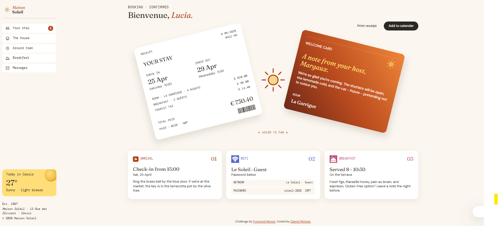

# Frontend Mentor - Hotel booking confirmation page solution

This is a solution to the [Hotel booking confirmation page challenge on Frontend Mentor](https://www.frontendmentor.io/challenges/hotel-booking-confirmation-page). Frontend Mentor challenges help you improve your coding skills by building realistic projects.

## Table of contents

- [Overview](#overview)
  - [The challenge](#the-challenge)
  - [Screenshot](#screenshot)
  - [Links](#links)
- [My process](#my-process)
  - [Built with](#built-with)
  - [What I learned](#what-i-learned)
  - [Continued development](#continued-development)
  - [Useful resources](#useful-resources)
  - [AI Collaboration](#ai-collaboration)
- [Author](#author)
- [Acknowledgments](#acknowledgments)

## Overview

### The challenge

Users should be able to:

- View the optimal layout for the interface depending on their device's screen size
- See hover and focus states for all interactive elements on the page
- Open and close the navigation menu on smaller screens using a CSS-only checkbox toggle
- See the two booking cards fan apart on desktop hover to reveal a sun illustration between them

### Screenshot



### Links

- Solution URL: [Solution URL](https://oms-hotel-booking-confirmation-page.vercel.app/)
- Live Site URL: [Live site URL](https://github.com/OMS-Create/oms-hotel-booking-confirmation-page/)
## My process

### Built with

- Semantic HTML5 markup (`aside`, `main`, `article`, `section`, `nav`, `dl`, `address`)
- CSS custom properties
- CSS Grid and Flexbox
- CSS transforms and transitions
- Locally hosted variable fonts via `@font-face`
- CSS-only mobile navigation toggle (checkbox hack)
- No JavaScript — all interactions are CSS-driven

### What I learned

#### Local font integration with `@font-face`

Three typefaces are loaded from the `assets/fonts/` directory using `@font-face`. DM Sans and Fraunces are variable fonts, so a single file covers the full weight range. Fraunces requires two separate `@font-face` declarations — one for normal style and one for italic — because variable font axes for optical size and softness differ between the two style files. DM Mono is a fixed-weight font loaded at 400 only. All three use `font-display: swap` so body text renders immediately in a fallback font while the custom files load.

```css
@font-face {
  font-family: 'DM Sans';
  src: url('./assets/fonts/dm-sans/DMSans-VariableFont_opsz,wght.ttf') format('truetype');
  font-weight: 400 700;
  font-style: normal;
  font-display: swap;
}

@font-face {
  font-family: Fraunces;
  src: url('./assets/fonts/fraunces/Fraunces-VariableFont_SOFT,WONK,opsz,wght.ttf') format('truetype');
  font-weight: 400 700;
  font-style: normal;
  font-display: swap;
}

@font-face {
  font-family: Fraunces;
  src: url('./assets/fonts/fraunces/Fraunces-Italic-VariableFont_SOFT,WONK,opsz,wght.ttf') format('truetype');
  font-weight: 400 700;
  font-style: italic;
  font-display: swap;
}

@font-face {
  font-family: 'DM Mono';
  src: url('./assets/fonts/dm-mono/DMMono-Regular.ttf') format('truetype');
  font-weight: 400;
  font-style: normal;
  font-display: swap;
}
```

Each font has a clear role: **DM Sans** for body copy and UI, **Fraunces** (including italic) for the guest name heading, date figures, and host welcome note, and **DM Mono** for receipt labels, navigation text, and the "HOVER TO FAN" hint.

#### Card fan hover revealing the sun illustration

The `.booking-summary` section is `position: relative` with a fixed height. Both booking cards are pulled out of document flow with `position: absolute` and placed at the centre of the container using `left: 50%; top: 50%`. A negative `translate()` on each card offsets them from centre so they overlap by default — the receipt tilts left at `–7deg` and the welcome card tilts right at `+7deg`.

The `illustration-sun.svg` sits in a `.center-sun-icon` div at `z-index: 0`, behind both cards, scaled down and nearly transparent at rest. When the container is hovered, both cards fan further outward with `rotate()`, their box-shadows deepen to reinforce depth, and the sun scales up and becomes fully opaque. The `cubic-bezier(.23, 1, .32, 1)` easing gives the movement a quick start and soft landing.

```html
<section class="booking-summary">
  <div class="center-sun-icon" aria-hidden="true">
    
  </div>
  <article class="receipt-card">...</article>
  <article class="greetings">...</article>
</section>
```

```css
/* Container */
.booking-summary {
  position: relative;
  height: 21rem;
}

/* Sun — hidden behind cards at rest */
.center-sun-icon {
  position: absolute;
  top: 48%;
  left: 50%;
  transform: translate(-50%, -50%) scale(0.8);
  opacity: 0.85;
  z-index: 0;
  transition: transform 0.45s cubic-bezier(.23, 1, .32, 1),
              opacity 0.45s ease;
}

/* Receipt card — left tilt */
.receipt-card {
  position: absolute;
  left: 50%;
  top: 50%;
  width: 50%;
  transform: translate(-88%, -52%) rotate(-7deg);
  transform-origin: bottom center;
  z-index: 1;
  transition: transform 0.45s cubic-bezier(.23, 1, .32, 1),
              box-shadow 0.3s ease;
}

/* Welcome card — right tilt */
.greetings {
  position: absolute;
  left: 50%;
  top: 50%;
  width: 48%;
  height: 88%;
  transform: translate(-12%, -52%) rotate(7deg);
  transform-origin: bottom center;
  z-index: 2;
  transition: transform 0.45s cubic-bezier(.23, 1, .32, 1),
              box-shadow 0.3s ease;
}

/* Fan on hover */
.booking-summary:hover .receipt-card {
  transform: translate(-108%, -52%) rotate(-14deg);
  box-shadow: -0.5rem 0.8rem 1.5rem rgba(51, 39, 29, 0.12);
}

.booking-summary:hover .greetings {
  transform: translate(8%, -52%) rotate(14deg);
  box-shadow: 0.5rem 0.8rem 1.5rem rgba(51, 39, 29, 0.15);
}

/* Sun revealed between fanned cards */
.booking-summary:hover .center-sun-icon {
  opacity: 1;
  transform: translate(-50%, -50%) scale(1.15);
}
```

On mobile (max-width: 767px) the `.center-sun-icon` and the `::after` hint are set to `display: none`, and both cards reset to `position: relative; transform: none !important` so they stack naturally in a single column.

### Continued development

- Wire up the Print receipt, Add to calendar, and Copy Wi-Fi password buttons with JavaScript
- Explore a touch-friendly alternative to the hover fan for mobile (tap to fan or swipe)
- Investigate `preload` link hints for the variable font files to further reduce the flash of unstyled text

### Useful resources

- [Variable Fonts Guide — MDN](https://developer.mozilla.org/en-US/docs/Web/CSS/CSS_fonts/Variable_fonts_guide) — essential for understanding why Fraunces needs two `@font-face` blocks (normal vs italic axes)
- [cubic-bezier.com](https://cubic-bezier.com) — used to visualise and tune the `.23, 1, .32, 1` easing on the card fan
- [The Markdown Guide](https://www.markdownguide.org/) — reference for writing this README

### AI Collaboration

Claude (Anthropic) was used during this project for:

- Debugging the CSS-only checkbox mobile menu — specifically getting the sibling combinator `.menu-toggle:checked ~ .nav-bar` to reach elements correctly given the checkbox position inside `.sidebar`
- Structuring the card fan — the approach of using `position: absolute` anchored at `left: 50%; top: 50%` with `translate()` offsets came out of back-and-forth with the model
- Reviewing accessibility attributes (`aria-labelledby`, `aria-hidden`, `aria-label`) across the semantic HTML

What worked well: using Claude to reason through CSS specificity conflicts and `transform-origin` behaviour. 

What didn't: early suggestions used JavaScript for the mobile menu toggle, which had to be redirected to the pure-CSS checkbox approach.

## Author

- Frontend Mentor — [@OMichaels](https://www.frontendmentor.io/OMS-Create)

## Acknowledgments

Challenge by [Frontend Mentor](https://www.frontendmentor.io/).
